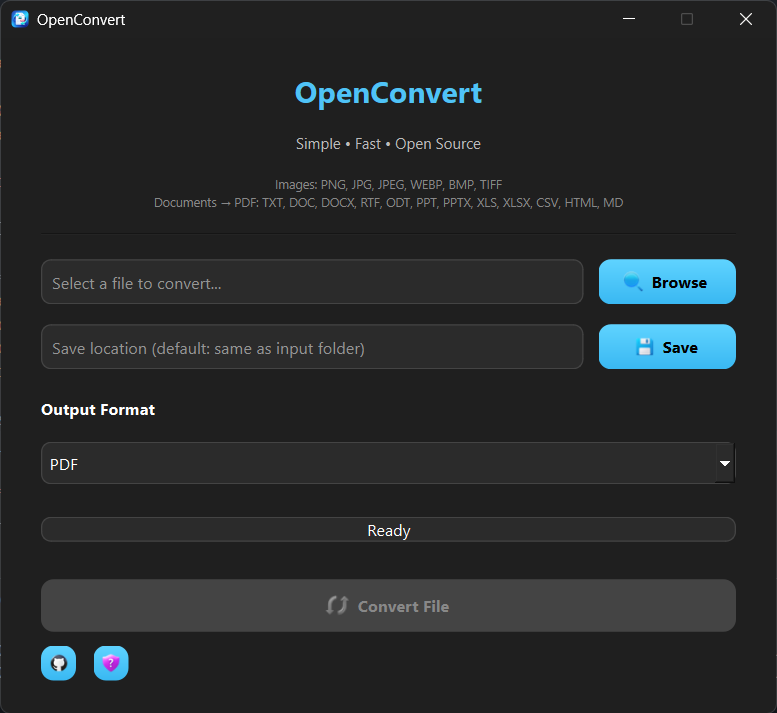

# OpenConvert 🚀

**Simple • Fast • Open Source**

OpenConvert is a modern, lightweight, multi-format file converter built with **Python + PyQt**.
It focuses on clean UI, offline usage, and real desktop-software experience.

  

---

## ✨ Features

* Modern dark UI (PyQt6)
* Choose input file
* Choose output format
* Choose custom save location
* Progress bar with background processing
* Fast, offline conversion
* Open source and beginner-friendly
* Windows native look with taskbar & title bar icon

---

## 🔄 Supported Formats

### 🖼 Image Conversions

Input & Output:

* PNG
* JPG / JPEG
* WEBP
* BMP
* TIFF

You can convert between any of these image formats.

---

### 📄 Document → PDF Conversions

| Format  | Description    |
| ------- | -------------- |
| `.txt`  | Text file      |
| `.doc`  | Microsoft Word |
| `.docx` | Microsoft Word |
| `.rtf`  | Rich Text      |
| `.odt`  | OpenDocument   |
| `.ppt`  | PowerPoint     |
| `.pptx` | PowerPoint     |
| `.xls`  | Excel          |
| `.xlsx` | Excel          |
| `.csv`  | Spreadsheet    |
| `.html` | Web page       |
| `.md`   | Markdown       |

All of these convert to **PDF**.

> Note: DOC, PPT, XLS based conversions require **Microsoft Office** installed on Windows.

---

## 🛠 Tech Stack

* Python 3.10+
* PyQt6 → GUI
* Pillow → Image conversion
* ReportLab → TXT → PDF
* pywin32 → Microsoft Office automation
* ctypes → Windows taskbar icon binding

---

## 🧪 Future Plans

* Drag & Drop support
* Batch file conversion
* Linux & macOS support
* EXE packaging
* More document formats
* Format auto-filtering

---

## 🤝 Contributing

Contributions are welcome!

You can help by:

* Improving UI
* Adding new formats
* Optimizing performance
* Writing docs

Just fork the repo and submit a PR.

---

## 📜 License

This project is open-source under the **MIT License**.
Use it, modify it, share it freely.

---

## 🧠 Why OpenConvert?

OpenConvert is built not just as a tool, but as a learning-focused project that demonstrates:

* Real GUI design
* Threading in desktop apps
* Windows integration
* Clean project structure
* Open-source collaboration

---
